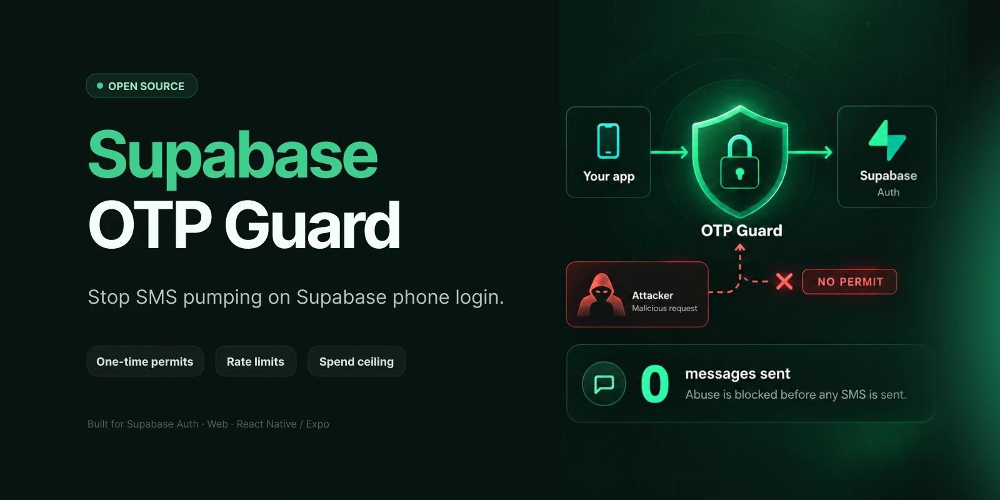
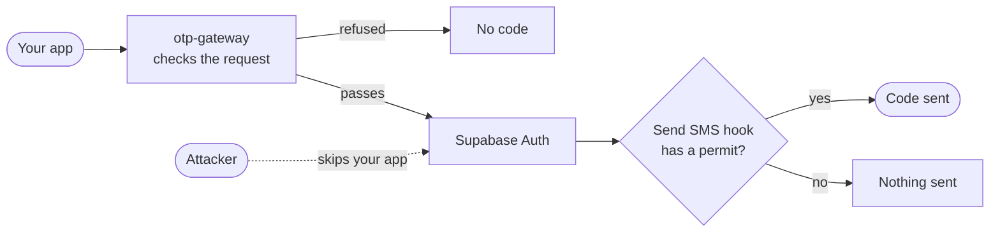

<div align="center">



**No permit → no SMS → no bill.**

[](https://github.com/m4st3rmiau/supabase-otp-guard/actions/workflows/ci.yml)


[Quickstart](docs/quickstart.md) · [How it works](docs/architecture.md) · [Documentation](docs/README.md)

</div>

---

## The problem

Phone login is an open door to your SMS bill. Anyone can call `signInWithOtp` with any number, and every call makes your provider send a paid message.

Attackers use this for **SMS pumping**: they send thousands of codes to numbers they get paid for, and you pay for every one. Supabase Auth sends whatever it is asked to send.

## The fix

otp-guard puts a checkpoint in front of every code. Your app asks the **gateway**, the gateway checks the request and issues a **one-time permit**, and only then does Supabase send the code. At the other end, the Send SMS hook refuses anything that arrives without a permit.



Calling Supabase directly, skipping your app, gets an attacker nothing. Here are both attacks against a live project:

<p align="center">
  
</p>

Run it on your own project with `npm run demo:attack`. It costs nothing.

## What you get

| | |
|---|---|
| **One-time permits** | A code only goes out for a request that passed your checks. |
| **Country allowlist** | Codes only go to countries you choose, before an account is even created. |
| **Rate limits** | Per phone, account, device and IP address. |
| **Rotation detection** | One device or IP cycling through numbers gets cut off. |
| **Spend ceiling** | A hard cap on messages per minute, hour and day for the whole project. |
| **Automatic blocks** | Repeat offenders are blocked, with a manual release that keeps the history. |
| **Web captcha** | Cloudflare Turnstile, checked by the gateway. |

It works with `signInWithOtp`, `signUp`, `resend`, phone changes, `reauthenticate` and MFA phone challenges, from the web and from React Native / Expo. Your app code does not change.

## Get started

It takes about 20 minutes. The [Quickstart](docs/quickstart.md) walks through every step.

1. **Copy** the migration and three Edge Functions into your Supabase project.
2. **Apply** the migration and choose the countries you serve.
3. **Deploy** the functions and turn on the two Auth hooks.
4. **Connect** your app:

```ts
import { createClient } from "@supabase/supabase-js"
import { browserDeviceId, createOtpGuardFetch } from "@otp-guard/client"

const supabase = createClient(SUPABASE_URL, SUPABASE_ANON_KEY, {
  global: {
    fetch: createOtpGuardFetch({ supabaseUrl: SUPABASE_URL, platform: "web", getDeviceId: browserDeviceId() }),
  },
})
```

5. **Verify** it with `npm run verify`, which checks your project without sending a single SMS.

> [!NOTE]
> This is a **template repository**. You copy the code into your project, read it and tune it; it is not a package that updates itself. Only the small client helper is meant for npm, and until it is published you can copy its single file.

## Is it right for you?

**A good fit if** you use Supabase phone login, pay for SMS or WhatsApp codes, and want a real limit on what abuse can cost you.

**Know its limits.** otp-guard makes abuse expensive and caps the damage, but it cannot tell a determined attacker with real phones and real numbers from a real user. It does not verify that requests come from your genuine mobile app (no App Attest or Play Integrity yet), and it does not stop phone number enumeration. The [security model](docs/threat-model.md) covers what it protects against and what it does not.

## Status

> [!IMPORTANT]
> **0.1, pre-release.** Tested against a real PostgreSQL, in Node and in Deno, and run end to end on a live Supabase project: the gateway issues the permit, both hooks run, the provider is called and its answer is handled, and a request without a permit is refused with nothing sent. The test provider wallet was empty, so that run delivered no SMS; the same Bird integration delivers in production elsewhere. Try it on a staging project first.

It started as the protection of a production app that was hit by real SMS pumping. This repository is a clean rewrite of that system with every threshold made configurable; the `strict` preset keeps the values that ran in production.

## Documentation

| Guide | |
|---|---|
| [Quickstart](docs/quickstart.md) | Install, deploy and verify, step by step |
| [How it works](docs/architecture.md) | The request flow and why the permit matters |
| [Configuration](docs/configuration.md) | Presets, countries, limits, environment variables |
| [Tuning](docs/tuning.md) | Choosing limits that fit your traffic |
| [Operations](docs/operations.md) | Monitoring, incidents and releasing a block |
| [Security model](docs/threat-model.md) | What is covered, what is not, and why |
| [Troubleshooting](docs/troubleshooting.md) | Common errors and what they mean |

## Contributing

```bash
npm install
npm test            # database, Edge Functions and client
npm run typecheck
npm run smoke:deno  # starts each function in Deno (needs deno installed)
```

The database tests run on a throwaway PostgreSQL: nothing touches a real project and no SMS is sent. CI runs everything on every push and pull request. To report a vulnerability, see [SECURITY.md](SECURITY.md).

## License

[MIT](LICENSE)

<sub>Community project, not affiliated with or endorsed by Supabase.</sub>
