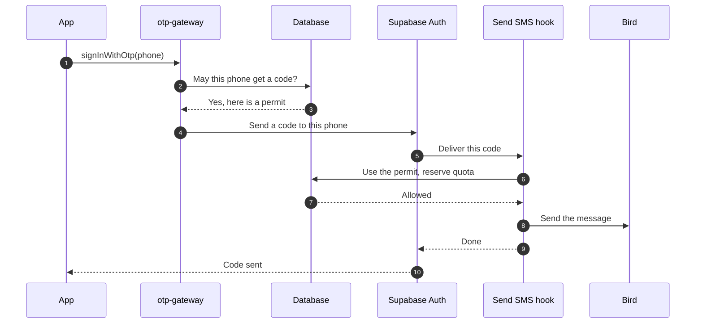

# How it works

## In one minute

1. Your app asks for a code. The client helper sends the request to the **gateway** instead of straight to Supabase.
2. The gateway checks who is asking: country, IP address, device, recent attempts and, on the web, a captcha. If everything passes, it writes a **permit** to the database: *this phone may receive one code in the next 60 seconds*.
3. The gateway passes the request on to **Supabase Auth**, which generates the code as usual.
4. Before anything is sent, Auth calls the **Send SMS hook**. The hook uses up the permit, checks the quotas and only then asks the provider to deliver the code.

Anyone who skips the gateway and calls Supabase directly reaches step 4 without a permit, and nothing is sent.

## The request, step by step

Supabase Auth still creates, stores and checks the code. `verifyOtp` never touches otp-guard: the protection is on sending codes, which is where the money goes.

## Why the permit matters

The Send SMS hook is where the money is spent, but it is also the place that knows the least. Supabase calls it server to server, with only the phone and the account: no IP address, no device, no idea who asked.

The gateway sees the real person making the request, so it makes the decision there and writes it down as a permit. When the hook uses up that permit, it gets two things it could never have on its own:

- **Who asked.** The IP address and device behind the send, for quotas and risk scoring.
- **A closed side door.** A direct call to Supabase creates no permit, so the hook refuses it before the provider is ever contacted.

A permit works once. It is used up even if a quota then refuses the send, and a permit cancelled because the Auth call failed still counts toward the limits, so failing on purpose erases nothing.

## What gets checked

| Where | Checks |
|---|---|
| **Gateway**, before Supabase | Blocked IP or device · allowed country · requests per IP and per device · numbers that were never verified · one IP or device cycling through numbers · captcha on the web |
| **Send SMS hook**, before the provider | A valid permit · blocks added since · per phone · per account · per device · project-wide spend ceiling |
| **Before User Created hook**, before a new account | Signups per IP and per device · allowed country · your own rules in `extensions.ts` |

Every rejection that says something about the requester is recorded. When one IP or device collects too many, it is flagged and then blocked automatically. See [Operations](operations.md#releasing-a-block) to release one.

## Which requests are guarded

| Supabase call | How the gateway knows the number | Captcha on the web |
|---|---|---|
| `signInWithOtp`, `signUp`, `resend`, `updateUser({ phone })` | It is in the request | Yes |
| `reauthenticate()` | From the signed-in account. Only when the account has no email, since Supabase uses the email first | No |
| `mfa.challenge()` on a phone factor | From the factor | No |

The last two only text a number the signed-in user already verified, and supabase-js sends no captcha token for them. They still need a permit and count toward every limit. When no SMS is involved, such as email reauthentication or an authenticator-app factor, the request passes through without a permit.

## New accounts

The Before User Created hook does receive an IP address, but for signups that came through the gateway, it is the gateway's own address, shared by every user. So when there is an active permit for the same phone, the signup check uses the permit's IP address and device instead. Email, OAuth and anonymous signups do not go through the gateway and use the hook's address, which is the real one for them.

## Where the data lives

Everything is in a private `otp_guard` schema that the Supabase API does not expose, with row-level security on every table. Only six functions are reachable, and only with the service role key, which never leaves your Edge Functions.

Phone numbers are stored only where a rule needs to compare them, and for at most 24 hours, except the list of numbers each device received codes for, kept for 90 days by default. Risk events store a hash of the number, never the number itself. Codes are never stored or logged. The full list is in the [security model](threat-model.md#data-it-keeps).

## Under the hood

<b>Concurrency</b>: why limits hold under bursts

Two transaction-level advisory locks serialize the decisions:

- `otp_guard:permits` for permit creation, so concurrent gateway calls from one IP cannot all pass the same limit.
- `otp_guard:risk` for send authorization, signup checks, risk scoring and releases, so the spend ceiling is exact.

They are always taken in that order, so no path can deadlock. Each is held for a few milliseconds, and the provider is called after the transaction commits. This is a single serialization point: fine for thousands of sends per hour, and the first thing to revisit if you need far more.

<b>Failure modes</b>: everything fails closed

| When | Result |
|---|---|
| The database is unreachable, slow (over 2.5 s) or returns something unexpected | Refused, the provider is never contacted |
| A setting is missing from `otp_guard.settings` | Refused |
| No country is allowed | Every number refused |
| A hook secret is missing or a signature is invalid | Refused |
| Turnstile is misconfigured or Cloudflare is down | Web requests refused |
| The provider fails | Refused, and the quota stays used |

The last row is deliberate: if a provider error gave the quota back, an attacker could keep retrying provider errors and never hit a limit.

<b>How the hooks reply</b>: always HTTP 200

Supabase Auth only passes a hook's error on to the app when the hook answers **HTTP 200** with `{"error": {"http_code": 429, "message": "..."}}` in the body. Any other status turns into a generic *Unexpected status code* error, and 429 or 503 make Auth retry the hook, which can never succeed here because the permit is already used. So both hooks always answer 200, and requests that do not come from Auth get a plain 401.

The `http_code` becomes the status of Auth's answer, and Supabase's edge re-runs the whole request, hooks included, whenever Auth answers with a 5xx. That suits a database that did not answer, reported as 503: the permit was not used yet, so the rerun can succeed. A provider failure happens after the permit is used, so it is reported as **424** instead: a rerun could only fail again, with the wrong message and one more signup attempt counted.

