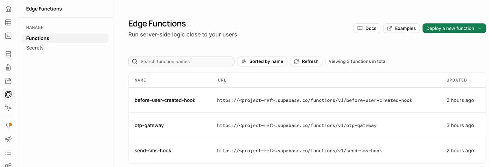
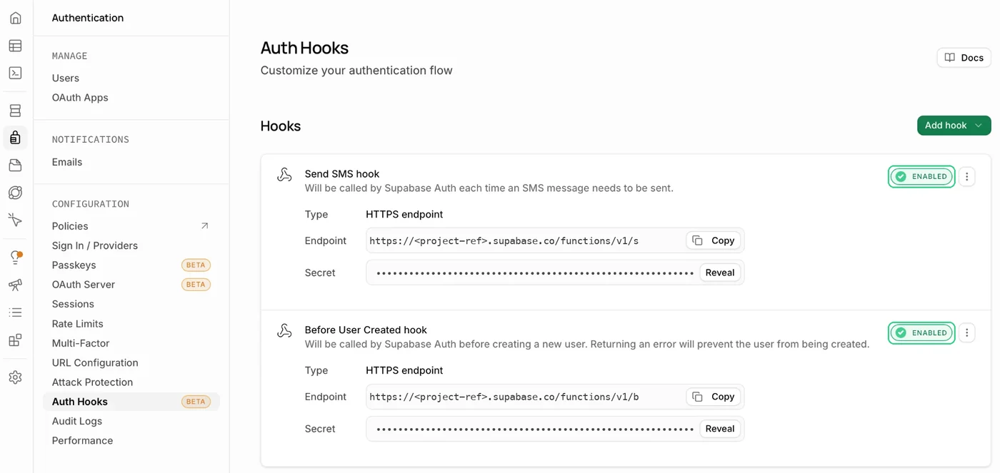
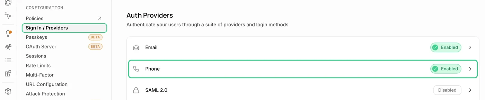
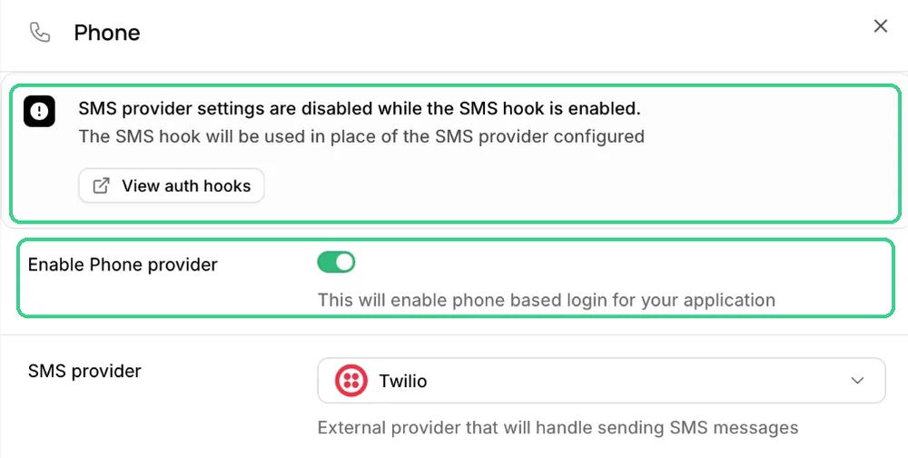

# Quickstart

Install otp-guard on your Supabase project in about 20 minutes. By the end, every phone code your project sends will need a permit, and you will have checked it yourself.

> [!TIP]
> Do it on a staging project first. When everything passes there, repeat the same steps on production.

## Before you start

- [ ] A Supabase project and the [Supabase CLI](https://supabase.com/docs/guides/cli), linked with `supabase link`
- [ ] An SMS provider account. [Bird](https://bird.com) is the one supported today
- [ ] For web apps: a [Cloudflare Turnstile](https://developers.cloudflare.com/turnstile/) widget
- [ ] This repository, cloned next to your project

---

## Step 1 · Copy the files

From this repository, copy the migration and the three Edge Functions into your project:

```bash
cp supabase/migrations/20260926000000_otp_guard.sql <project>/supabase/migrations/
cp -r supabase/functions/_shared/otp-guard <project>/supabase/functions/_shared/
cp -r supabase/functions/otp-gateway supabase/functions/send-sms-hook \
      supabase/functions/before-user-created-hook <project>/supabase/functions/
```

> [!NOTE]
> Supabase applies migrations in filename order. If your project already has later migrations, rename the file with a newer date. If you already have a Before User Created hook, move your rules into `before-user-created-hook/extensions.ts`: a project can only have one.

## Step 2 · Create the database pieces

Review what will be applied, then apply it:

```bash
supabase db push --dry-run
supabase db push
```

Then choose the countries that may receive codes. **Until you add one, every phone number is refused.** In the SQL editor:

```sql
-- +52 followed by 10 digits
INSERT INTO otp_guard.allowed_destinations (prefix, digits, label) VALUES ('52', 12, 'Mexico');
```

The migration starts with the `strict` preset, which suits a small app. If you expect a lot of traffic, pick another one now and read [Tuning](tuning.md) later:

```sql
SELECT otp_guard.apply_preset('balanced');
```

## Step 3 · Deploy the functions

```bash
supabase functions deploy otp-gateway --no-verify-jwt
supabase functions deploy send-sms-hook --no-verify-jwt
supabase functions deploy before-user-created-hook --no-verify-jwt
```

`--no-verify-jwt` is intentional. The gateway is a public endpoint that runs its own checks, and the hooks verify the signature Supabase Auth puts on every hook call.

In **Edge Functions**, you should now see all three:



<details>
<summary>Prefer <code>config.toml</code>?</summary>

```toml
[functions.otp-gateway]
verify_jwt = false

[functions.send-sms-hook]
verify_jwt = false

[functions.before-user-created-hook]
verify_jwt = false
```

</details>

## Step 4 · Turn on the Auth settings

Three settings, all in the Supabase dashboard under **Authentication**. Do them in this order.

### 4a. Add the two hooks

Open **Auth Hooks → Add hook** and add each one as an **HTTPS endpoint**:

| Hook | Endpoint |
|---|---|
| **Send SMS hook** | `https://<project-ref>.supabase.co/functions/v1/send-sms-hook` |
| **Before User Created hook** | `https://<project-ref>.supabase.co/functions/v1/before-user-created-hook` |

For each one, click **Generate secret** and keep it: you will need both in step 5. When you are done, both show as **Enabled**:



### 4b. Turn on phone sign-in

Open **Sign In / Providers → Phone**:



Switch on **Enable Phone provider** and save. Because the Send SMS hook is already on, Supabase disables the SMS provider settings and uses the hook instead, so leave those fields empty:

<p align="center">
  
</p>

> [!TIP]
> Keep **SMS OTP Expiry** in the same panel equal to `BIRD_SMS_TTL_MINUTES`, since Bird's template tells users how long the code lasts.

### 4c. Keep the project captcha off

**Attack Protection → CAPTCHA** must stay **off**. The gateway checks Turnstile itself, and a second check of the same token would reject every web login.

<details>
<summary>Prefer <code>config.toml</code>?</summary>

Then run `supabase config push`. The dashboard route above is the one that has been verified end to end.

```toml
[auth.hook.send_sms]
enabled = true
uri = "https://<project-ref>.supabase.co/functions/v1/send-sms-hook"
secrets = "env(SEND_SMS_HOOK_SECRET)"

[auth.hook.before_user_created]
enabled = true
uri = "https://<project-ref>.supabase.co/functions/v1/before-user-created-hook"
secrets = "env(BEFORE_USER_CREATED_HOOK_SECRET)"
```

</details>

## Step 5 · Add your secrets

Copy the example file, fill it in, and upload it. The example explains where each value comes from.

```bash
cp supabase/functions/.env.example supabase/functions/.env
supabase secrets set --env-file supabase/functions/.env
```

> [!WARNING]
> `supabase/functions/.env` holds real secrets and is ignored by git. Never commit it. Do not add `SUPABASE_*` variables to it either: Supabase provides them.

Two settings depend on your app:

- **Web only?** Add `OTP_GUARD_MOBILE=off`. The mobile path has no captcha, so close it if you do not use it.
- **No web app?** Leave `OTP_GUARD_ALLOWED_ORIGINS` empty, and every web request is refused.

Every variable is listed in [Configuration](configuration.md#3-set-the-environment-variables).

## Step 6 · Connect your app

Install the client helper:

```bash
npm install @otp-guard/client
```

> [!NOTE]
> Until the package is on npm, copy its single file, which has no dependencies:
> `cp packages/client/src/index.ts <app>/src/lib/otp-guard.ts`

Pass it to supabase-js as its `fetch`. On the web:

```ts
import { createClient } from "@supabase/supabase-js"
import { browserDeviceId, createOtpGuardFetch } from "@otp-guard/client"

const supabase = createClient(SUPABASE_URL, SUPABASE_ANON_KEY, {
  global: {
    fetch: createOtpGuardFetch({ supabaseUrl: SUPABASE_URL, platform: "web", getDeviceId: browserDeviceId() }),
  },
})

// Unchanged app code, plus the Turnstile token on the web:
await supabase.auth.signInWithOtp({ phone, options: { captchaToken } })
```

Full examples: [Next.js](../examples/nextjs/supabase.ts) · [Turnstile widget](../examples/nextjs/turnstile.ts) · [Expo / React Native](../examples/expo/supabase.ts)

Only the requests that send a code by phone go through the gateway: `signInWithOtp`, `signUp`, `resend`, phone changes, `reauthenticate` and MFA phone challenges. Everything else, including email login and `verifyOtp`, goes straight to Supabase as before.

## Step 7 · Check that it works

**Check the setup.** Copy `.env.verify.example` to `.env.verify` (also ignored by git), fill in your project URL and keys, and run the checker. It sends no SMS.

```bash
cp .env.verify.example .env.verify
supabase secrets set OTP_GUARD_DIAGNOSTICS=true
npm run verify
supabase secrets unset OTP_GUARD_DIAGNOSTICS
```

It confirms that the migration is in place, that nobody can call its functions from the browser, that the gateway sees real IP addresses, and that the phone provider and both hooks are on.

**Watch it stop an attack.** Also free, no SMS:

```bash
npm run demo:attack
```

It tries two attacks: a code to a country you do not serve, and a call straight to Supabase that skips your app. Both should be refused, and it should end with `Messages sent: 0`.

**Send one real code.** This costs one message:

```bash
npm run e2e:mobile -- +525512345678
```

It checks that a foreign number is refused for free, sends a code to your phone and verifies the one you type, then calls Supabase directly, skipping the gateway, and confirms that nothing is sent. Test the web path from your own app, with Turnstile.

If your provider does not deliver (an empty wallet, an unapproved template), the run still proves otp-guard's part: it confirms that the permit was used and exactly one send was authorized, reports the provider as a `WARN`, and goes on to the direct-call test. The provider's own reason is in the send-sms-hook log.

All green? You are protected. If something fails, see [Troubleshooting](troubleshooting.md).

---

## Rolling out to an app already in production

Once the Send SMS hook is on, any client that still talks to Supabase directly gets *"Please request a new code from the app."* So:

1. Ship the client change (step 6) first.
2. Wait until most users have it. For Expo, that means the OTA update has been adopted.
3. Then turn on the hooks (step 4).

There is no "permit optional" mode on purpose: the side door would stay open for as long as it existed.

## Next steps

- [Tuning](tuning.md): set a spend ceiling that fits your traffic.
- [Operations](operations.md): what to watch, and what to do during an incident.
